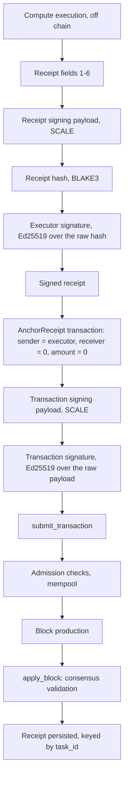

# Compute receipts and receipt anchoring

> **Document type:** Architecture — descriptive
> **Status:** Describes protocol v0.3 as implemented on `dev`
> **Normative sources:** [RFC 0002](../rfcs/0002-receipt-anchoring-v0.3.md),
> [`PROTOCOL_LOCK_v0.3.md`](../specs/PROTOCOL_LOCK_v0.3.md) (FROZEN),
> [`RECEIPT_SPEC_v0.1.md`](../specs/RECEIPT_SPEC_v0.1.md)

This document describes what the chain and the TypeScript SDK actually do
today. Where it states a rule, that rule exists in the runtime; where something
is absent, it says so rather than describing an intention. It defines no new
protocol behaviour.

---

## 1. Purpose

A **compute receipt** is a signed, self-contained statement by an executor that
it ran some task and produced some output. The chain stores it and guarantees
three things: the receipt is structurally canonical, the executor signed it,
and no other receipt for the same task has been anchored before it.

The chain deliberately validates **nothing about the work itself**. It does not
re-execute the task, does not check that the output follows from the input, and
holds no opinion on whether the executor was entitled to run it. Anchoring
establishes *who claimed what, and first* — not that the claim is true.

`metadata` is an opaque application-layer pointer. The chain never interprets
it; anything larger than a commitment belongs off-chain behind a hash, which is
the design philosophy the size cap enforces.

---

## 2. Data model

### 2.1 Receipt

Seven fields, in canonical order
(`crates/mbongo-core/src/receipt.rs`):

| # | Field | Type | Notes |
|---|---|---|---|
| 1 | `version` | `u8` | must be `1` |
| 2 | `task_id` | `[u8; 32]` | opaque to the chain; the uniqueness key |
| 3 | `input_commitment` | `[u8; 32]` | opaque |
| 4 | `output_commitment` | `[u8; 32]` | opaque |
| 5 | `executor` | `Address` | the executor's Ed25519 public key |
| 6 | `metadata` | `Vec<u8>` | opaque, at most 4096 bytes |
| 7 | `signature` | `[u8; 64]` | Ed25519, see §3 |

Adding, removing or reordering fields is a protocol change.

`MAX_RECEIPT_METADATA_BYTES = 4096` is normative through
[RFC 0002 §3](../rfcs/0002-receipt-anchoring-v0.3.md) (approved 2026-07-19) and
frozen by `PROTOCOL_LOCK_v0.3`. Every other field is fixed-size, so the cap
bounds the whole receipt: a maximal receipt encodes to **4291** bytes.

### 2.2 Transaction

Seven fields (`crates/mbongo-core/src/primitives.rs`):

| # | Field | Type |
|---|---|---|
| 1 | `tx_type` | `TransactionType` |
| 2 | `sender` | `Address` |
| 3 | `receiver` | `Address` |
| 4 | `amount` | `u128` |
| 5 | `nonce` | `u64` |
| 6 | `payload` | `TransactionPayload` |
| 7 | `signature` | `[u8; 64]` |

Both enums carry explicit `#[codec(index = …)]` attributes, so their SCALE
discriminants do not depend on declaration order:

| Variant | Discriminant |
|---|---|
| `TransactionType::AnchorReceipt` | `0x03` |
| `TransactionPayload::AnchorReceipt(Box<Receipt>)` | `0x01` |

`Box<T>` encodes identically to `T`, so the payload is `0x01` followed
**directly** by the canonical receipt bytes. There is no length prefix and no
second encoding layer.

---

## 3. Cryptographic domains

This is the part most easily got wrong, so it is stated in full.

### 3.1 The five values

**Receipt signing payload** — SCALE of receipt fields 1–6, signature excluded.
`metadata` carries a SCALE compact length prefix; at 4096 bytes that prefix is
**two** bytes, not one.

**Receipt hash** — `BLAKE3(receipt signing payload)`, 32 bytes.

**Receipt signature** — `Ed25519(executor key, the raw 32 bytes of the receipt
hash)`. Over the raw digest, never over its hex text.

**Transaction signing payload** — SCALE of transaction fields 1–6, signature
excluded. For an `AnchorReceipt`:

```
0x03 || sender[32] || receiver[32] || amount_u128_le[16]
     || nonce_u64_le[8] || 0x01 || <full canonical receipt bytes>
```

Integers are little-endian and fixed-width, never compact. Every field before
the receipt is fixed-width, so the receipt bytes always begin at **offset 90**
(`1 + 32 + 32 + 16 + 8 + 1`), whatever the metadata length.

**Transaction signature** — `Ed25519(sender key, the raw transaction signing
payload)`. **There is no prehash.** The payload bytes are signed directly.

**Transaction hash** — `BLAKE3(full signed transaction SCALE)`, which is the
signing payload followed by the 64-byte signature. It therefore *covers* the
signature. This is the value `submit_transaction` returns.

### 3.2 What must not be confused

| | Content | Hashed before signing? |
|---|---|---|
| receipt hash | the receipt, its signature excluded | yes |
| transaction signing message | the whole transaction, its signature excluded | **no** |
| transaction hash | the whole transaction, its signature **included** | yes |

Anchoring requires `tx.sender == receipt.executor` (§5, rule (g)), so in
practice **the same Ed25519 key produces both signatures**. They are still
different signatures, because the messages differ:

| Signature | Key | Message |
|---|---|---|
| `receipt.signature` | executor | the raw 32-byte receipt hash |
| `transaction.signature` | sender | the raw transaction signing payload |

Consequences worth stating explicitly:

- `receipt.signature` **is not** `transaction.signature`.
- The receipt hash **is not** the transaction signing message.
- Applying the receipt's hash-then-sign pattern to a transaction produces a
  signature the node rejects.
- Because Ed25519 is deterministic here, signing the receipt hash reproduces
  the receipt's own signature exactly — so "sign the receipt hash" and "reuse
  the receipt signature" are the same mistake, not two.

---

## 4. Lifecycle



The chain enters this picture only at `submit_transaction`. Everything above it
is the executor's own doing, and nothing in the chain verifies that the
execution happened.

---

## 5. Validation

Three layers enforce overlapping rules. They are not interchangeable.

### 5.1 SDK, local

Runs before anything leaves the process: receipt version, field widths, the
4096-byte metadata bound, a safe non-negative `nonce`, and that the signing key
derives `receipt.executor`. Its purpose is to fail fast on transactions that
could never be anchored. **It is not a substitute for consensus** and carries
no authority.

### 5.2 Node admission

`submit_transaction` mirrors the consensus order on a best-effort basis and
mutates no state (`crates/mbongo-node/src/backend.rs`). Observed order:

1. type/payload consistency
2. anchoring field constraints — `amount == 0` and `receiver == 0`
3. transaction already stored
4. transaction signature
5. sender account exists
6. `nonce` equals the account's current nonce
7. balance
8. (e) metadata within 4096
9. (f) receipt version
10. (g) `sender == receipt.executor`
11. (h) receipt executor signature
12. (i) `task_id` already anchored
13. mempool duplicates, including a pending `task_id`

A sender whose account does not exist fails at step 5 as
`"insufficient balance"`, so a freshly generated key cannot anchor.

### 5.3 Consensus, `apply_block`

Authoritative. The same lettered rules (e)–(j) are enforced again with the
offending transaction index in the error, plus (j): two receipts for one
`task_id` inside a single block reject the whole block. Admission is an
optimisation; `apply_block` decides.

---

## 6. Persistence

Receipts live in a dedicated RocksDB column family, `receipts`, introduced by
schema version 2. See
[`storage_invariants.md`](storage_invariants.md) for the full rules.

- **Key:** the raw 32-byte `task_id`. **Value:** opaque receipt bytes; the
  storage layer never decodes or validates them.
- **Batch-only writes** through `BatchOp::PutReceipt`, inside the same atomic
  `write_batch` as block state. There is no standalone insert and no
  check-then-insert at the storage layer.
- **Derived state:** fully reconstructable by replay from genesis.

### 6.1 Uniqueness, and what it does not give you

`task_id` uniqueness is global and **first-anchored-wins**. A second attempt is
rejected — `task_id already anchored` at admission,
`TaskIdAlreadyAnchored(index)` at consensus.

There is **no index from `receipt_hash` to anything**, and no index from
`task_id` to the block height that anchored it. The only lookup the storage
layer offers is `task_id → receipt bytes`, and no RPC method exposes it (§7).

---

## 7. Interoperability

### 7.1 The RPC boundary

Anchoring uses the ordinary `submit_transaction` method of
[`rpc_v0.2.md`](../specs/rpc_v0.2.md) (FROZEN). **There is no dedicated receipt
submission RPC**, and none is needed. `submit_receipt` and `get_receipt` are
not served: they return `-32601`.

A successful `submit_transaction` means the node accepted the transaction into
its **mempool**. It does not mean the transaction is in a block.

### 7.2 JSON representation of a nested receipt

Inside an `AnchorReceipt` payload, three byte representations coexist. This is
the runtime's actual serde output:

| Field | Rust type | JSON |
|---|---|---|
| `executor` | `Address` | `"0x…"` hex string |
| `signature` | `[u8; 64]` + `serde_arr64` | `"0x…"` hex string |
| `task_id` | `[u8; 32]` | **array of numbers** |
| `input_commitment` | `[u8; 32]` | **array of numbers** |
| `output_commitment` | `[u8; 32]` | **array of numbers** |
| `metadata` | `Vec<u8>` | **array of numbers** |

Hex appears exactly where the Rust type has a custom serializer. Plain
`[u8; 32]` and `Vec<u8>` carry no annotation and fall through to serde's
default sequence handling.

The general byte-encoding sentence in `rpc_v0.2.md` does not describe those
four fields. That wording is documentation debt tracked in
[#96](https://github.com/MbongoChain/mbongo-chain/issues/96); the runtime
behaviour above is current and pinned by a committed fixture, and this document
changes neither.

### 7.3 Neutral fixtures

Two language-neutral fixtures are the interoperability source of truth:

| File | Pins |
|---|---|
| [`test-vectors/receipt/receipt-v1.json`](../../test-vectors/receipt/receipt-v1.json) | receipt encoding, hash, executor signature |
| [`test-vectors/transaction/anchor-receipt-v1.json`](../../test-vectors/transaction/anchor-receipt-v1.json) | transaction signing bytes, signature, full encoding, transaction hash, JSON object |

The transaction fixture **references** a receipt vector by name rather than
restating one, so there is exactly one receipt source of truth and the
dependency points one way.

Their expected values were derived from the protocol rules — SCALE laid out by
hand, integers by explicit little-endian construction, signatures and hashes
from independent implementations — and **not** by encoding with production
Rust. Both Rust and TypeScript are *consumers* that must agree with values
neither produced. That is what makes the "Rust output becomes TypeScript's
expected output" circle impossible.

---

## 8. Security properties

What anchoring establishes:

- The receipt is structurally canonical and its version is supported.
- The key in `executor` signed **this exact receipt**.
- The account that submitted it is that same key (rule (g)).
- No receipt for this `task_id` was anchored earlier.
- The receipt bytes are committed atomically with the block that carries them,
  and survive replay from genesis.

What it does **not** establish:

- that the computation was performed,
- that it was performed correctly,
- that the output follows from the input,
- that the executor was authorised to run the task,
- that anything was settled or paid.

An anchored receipt is a timestamped, signed, first-come claim. Treating it as
proof of work performed is the single most available misreading of this
subsystem.

---

## 9. Limitations

- **No retrieval by `task_id`.** There is no `task_id → height` index, so a
  receipt can only be found by inspecting a block whose height is already
  known. The SDK slice for that is
  [#86](https://github.com/MbongoChain/mbongo-chain/issues/86) and is not
  implemented.
- **No `receipt_hash` lookup** of any kind.
- **No nonce discovery in the SDK.** JSON-RPC v0.2 has no account method; the
  REST surface has an account route, which the TypeScript client does not
  model.
- **No generic transaction signing in the SDK.** Only `AnchorReceipt`, whose
  `amount` is pinned to `0`. Full-range `u128`/`u64` wire interoperability is
  [#91](https://github.com/MbongoChain/mbongo-chain/issues/91) and unresolved.
- **No wallet.** No key storage, derivation, mnemonics or keystore anywhere in
  the SDK.
- **Duplicate attribution is not directly answerable.** A
  `task_id already anchored` rejection cannot distinguish "I anchored it" from
  "someone else did". Neither the JSON-RPC surface nor the REST surface exposes
  a receipt lookup, so short of scanning every block for the `task_id`, nothing
  answers it. Record the transaction hash and height at submission time
  instead.
- **`rpc_v0.2` byte-encoding wording** is inaccurate for the nested receipt;
  see §7.2 and #96.

---

## 10. What this enables

An executor can produce a signed receipt as evidence of a compute execution,
and anchor it through the normal transaction path from either Rust or
TypeScript, with byte-level agreement between the two guaranteed by shared
fixtures.

That is the whole of it today. Worker assignment, marketplaces, payment,
rewards, redundancy, fraud proofs, TEE attestation and ZK verification are
**not implemented** and are not designed by this document. Where the repository
discusses them, it does so as forward-looking material — see
[`VISION_v1.md`](../VISION_v1.md) and
[`COMPUTE_INTERFACE_v0.1.md`](../specs/COMPUTE_INTERFACE_v0.1.md) — and none of
it is protocol.

---

## See also

- [Working with compute receipts](../development/compute-receipts.md) — the
  developer guide
- [RFC 0002](../rfcs/0002-receipt-anchoring-v0.3.md) — normative design
- [`RECEIPT_SPEC_v0.1.md`](../specs/RECEIPT_SPEC_v0.1.md) — receipt structure
- [`rpc_v0.2.md`](../specs/rpc_v0.2.md) — the RPC surface (FROZEN)
- [`storage_invariants.md`](storage_invariants.md) — storage rules
- [`RECEIPT_ANCHORING_V03_AUDIT.md`](../RECEIPT_ANCHORING_V03_AUDIT.md) —
  implementation-truth audit of the runtime
