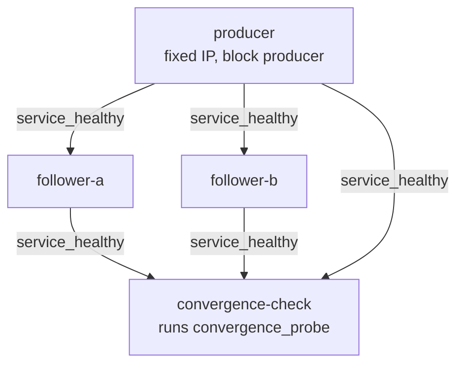

# Deterministic Devnet Architecture

This document describes the devnet infrastructure as it is implemented on
`dev` today. Every statement below is derived from the files it cites; where
a property is *not* guaranteed, that is stated explicitly rather than left to
inference.

For day-to-day commands, see the [Devnet Developer Guide](../development/devnet.md).

## Purpose

Running a multi-node Mbongo network used to require starting several
`mbongo-node` processes by hand, on one machine, and judging by eye whether
they had agreed on the same chain. That is slow to set up, hard to reproduce
on a different machine, and impossible to assert in CI.

This infrastructure gives the project a network that a contributor can boot
with one command from a clean checkout, that behaves the same way on a
developer laptop and on a CI runner, and whose success or failure is decided
by a program rather than by a human reading logs.

It is a **development network**. It is not a public testnet, not a staging
environment, and not a production deployment. It runs a single block producer
and pre-funds a well-known development key, so it makes no claim about
decentralisation, adversarial resistance, or economic behaviour.

## Scope

Covered here:

- the three-node Docker/Compose devnet and its service graph
- the network surfaces each node exposes and where they are bound
- how followers find the producer
- which component owns node lifecycle in each execution path
- the difference between readiness and convergence
- the shared convergence invariants and their consumers
- configuration layering and what "deterministic" does and does not mean
- how CI validates both execution paths

Not covered here: consensus rules, receipt anchoring, storage schema, or the
protocol itself. Those live under [docs/specs](../specs) and the RFCs.

## Topology

Three nodes run the same image, distinguished only by role, data directory
and network attachment ([docker-compose.yml](../../docker-compose.yml)):

| Service | Role | Producer flag | Bootnode |
|---|---|---|---|
| `producer` | block producer | `--producer --block-time=${MBONGO_BLOCK_TIME}` | none |
| `follower-a` | follower | — | producer address |
| `follower-b` | follower | — | producer address |
| `convergence-check` | one-shot verdict | — | not a node |

All three nodes use the *same* in-container ports. Isolation comes from the
dedicated Compose network, not from assigning different port numbers per
node.



`convergence-check` is not a fourth node. It carries `profiles: ["check"]`,
so `docker compose up` never starts it implicitly; it is run on demand, exits
with a verdict, and is removed.

## Network Surfaces

Each node serves three surfaces:

| Surface | Flag | Default bind host | Default port |
|---|---|---|---|
| JSON-RPC | `--rpc-host` / `--rpc-port` | `127.0.0.1` | `9944` |
| REST | `--rest-host` / `--rest-port` | `127.0.0.1` | `8080` |
| P2P | `--p2p-port` | always `0.0.0.0` | `30333` |

The RPC and REST bind hosts are configurable and **default to loopback**
([main.rs](../../crates/mbongo-node/src/main.rs)); a node started with no new
flags binds exactly where it always has. The value must be an IP literal:
`resolve_bind_addr` parses it and is called immediately after argument
parsing, so an invalid host fails before storage is opened or any socket is
created. Host names are deliberately not resolved, because a bind address has
to be unambiguous.

P2P has no host flag. `P2PNode::listen` always listens on
`/ip4/0.0.0.0/tcp/{port}` ([p2p.rs](../../crates/mbongo-network/src/p2p.rs)).

Inside the devnet, `.env.base` sets `MBONGO_RPC_HOST` and `MBONGO_REST_HOST`
to `0.0.0.0` so containers can reach each other across the Compose network.
**This is a devnet-only setting scoped to that network, not a production
default**, and the RPC surface has no authentication.

Only one port is published to the host: the producer JSON-RPC, on loopback
only, at `127.0.0.1:${MBONGO_HOST_RPC_PORT}`. Follower RPC, all REST surfaces
and all P2P ports stay inside the Compose network.

## Peer Discovery and Bootstrapping

A node generates a **fresh libp2p identity on every start**:
`SwarmBuilder::with_new_identity()`. There is no node-key flag, and no JSON-RPC
method returns the local PeerId. A PeerId therefore cannot be known before the
node runs, and cannot be pinned in configuration.

The bootstrap works around this rather than changing the node. Compose gives
the producer a fixed address on the devnet network (`ipv4_address:
${MBONGO_PRODUCER_IP}`, inside `${MBONGO_SUBNET}`), and each follower receives:

```
--bootnodes=/ip4/${MBONGO_PRODUCER_IP}/tcp/${MBONGO_P2P_PORT}
```

That multiaddr carries **no `/p2p/<peer-id>` component**. `P2PNode::dial`
parses the string into a `Multiaddr` and hands it to `Swarm::dial`, which
accepts an address that does not name a peer; the remote identity is
established when the connection is established, not read from configuration.
The transport is TCP with noise encryption and yamux multiplexing, as declared
in the swarm builder.

The node also runs an mDNS behaviour that dials peers it discovers. Nothing
here disables it, and it may well form additional connections on a Compose
network. It is simply not what the devnet relies on: the explicit bootnode
address is the bootstrap contract, and it is what the Compose configuration
declares.

Note that the libp2p transport is built with `.with_tcp(...)` and no DNS
transport, so bootnode multiaddrs must be `/ip4/...`; a `/dns4/<service>/...`
address would not resolve.

## Lifecycle Ownership

Three components exist, and they own very different things.

**`devnet_harness`** ([devnet_harness.rs](../../crates/mbongo-node/src/bin/devnet_harness.rs))
owns node lifecycle completely. It spawns `mbongo-node` child processes with
`kill_on_drop`, extracts the producer PeerId from its stdout to build a
bootnode multiaddr, waits for RPC readiness, then drives scenarios a static
network cannot cover: it kills and restarts the producer, kills and restarts a
follower, submits receipt-anchoring transactions, and cleans up its temporary
data directories on both entry and exit. It is a process-mode integration
test that happens to build a network.

**`convergence_probe`** ([convergence_probe.rs](../../crates/mbongo-node/src/bin/convergence_probe.rs))
owns no lifecycle at all. It is given endpoints (`--endpoint name=url`,
repeatable, at least two) and never starts, stops or restarts anything. It
waits for readiness within a bound, then applies the shared convergence
invariants and exits `0` or non-zero.

**The Docker devnet** puts lifecycle in Compose, orchestrated by
[docker-devnet.sh](../../scripts/devnet/docker-devnet.sh): Compose creates,
health-checks and removes containers, and `convergence-check` runs the probe
against the three already-running nodes.

These are two execution paths, not duplicated logic. What could have been
duplicated — the definition of "converged" — is shared, as described below.

## Readiness vs Convergence

These are separate questions, answered by separate mechanisms, and conflating
them is the main way this design can be broken.

**Readiness** asks: *does this node serve JSON-RPC yet?* The container
healthcheck ([docker/healthcheck.sh](../../docker/healthcheck.sh)) posts a
JSON-RPC `ping` and requires a `"result"` in the response. This is stronger
than "the container is running": the RPC server binds only after storage is
open, genesis exists and the P2P stack is up. It is nevertheless **not** a
statement about the chain. A single healthy node says nothing about agreement.

**Convergence** asks: *do all nodes agree on the same chain, and is it
advancing?* Only `convergence_probe` answers this. It requires every endpoint
to report an identical height and an identical tip hash, at or above a floor.
By default the floor is one block above the highest height observed once every
node is ready, so a stalled chain whose nodes merely agree on an old tip does
not pass.

Nothing in the Compose file, the healthchecks, the shell script, the Makefile
or the CI workflow compares heights or tip hashes.

## Shared Convergence Invariants

`mbongo_node::convergence` ([convergence.rs](../../crates/mbongo-node/src/convergence.rs))
is the single implementation of how a devnet is probed and what counts as
converged. It exposes the endpoint type (`NodeEndpoint`), the RPC helpers, a
bounded readiness wait (`await_endpoints_ready`), the pure comparison
(`convergence_error`), and the bounded polling loop (`await_convergence`). It
performs no process management.

Both binaries consume it: `devnet_harness` against the nodes it spawns over
loopback, `convergence_probe` against endpoints someone else owns.
`NodeEndpoint::localhost_port` reproduces the harness's historical
`http://127.0.0.1:{port}/rpc` addressing, so extracting the logic did not
change how the harness dials.

The point is narrow but important: a change to what "converged" means happens
in exactly one place and applies to both paths at once.

## Configuration Layers

`docker-devnet.sh` builds the Compose `--env-file` list, and Compose applies
those files left to right, so a later file overrides an earlier one:

| Layer | Versioned | When applied |
|---|---|---|
| `.env.base` | yes | always |
| `.env.local` | **no** — gitignored | `DEVNET_ENV` unset or `local`, and the file exists |
| `.env.ci` | yes | `DEVNET_ENV=ci` |

`.env.base` alone is sufficient: a fresh checkout boots without `.env.local`,
and the script only adds that layer when the file is present. `DEVNET_ENV=ci`
selects `.env.ci` **instead of** `.env.local`, never both. Any other value is
rejected with a non-zero exit.

Neither versioned file contains a secret, and the devnet needs none.

## Determinism Guarantees

"Deterministic" here is a claim about **configuration and orchestration**, not
about producing identical bytes on every run. Concretely, these are fixed by
the repository rather than by the machine that runs it:

- **Topology**: three nodes, one producer, two followers, declared in Compose.
- **Service graph**: followers start only once the producer reports healthy;
  the convergence check runs only once all three report healthy.
- **Addressing**: a dedicated network with a declared subnet, and a fixed
  producer IP, so the follower bootnode address is known before anything runs.
- **Ports**: identical in-container ports for every node, from `.env.base`.
- **Node parameters**: chain, block time, bind hosts and data directories all
  come from the environment layers, not from defaults that could drift.
- **Build inputs**: the image builds with `--locked` against the committed
  `Cargo.lock`, on a pinned Rust toolchain (`RUST_VERSION=1.94.0`), so the
  builder does not follow whatever the floating `rust:1` tag resolves to.
- **Orchestration path**: local runs and CI runs execute the same script, so
  the two cannot drift apart.
- **Acceptance criteria**: readiness and convergence are defined in code with
  bounded timeouts, not by a human judgement call.

### What is not guaranteed

- **PeerIds are not deterministic.** Every node generates a fresh identity at
  start, so peer identifiers differ between runs and even between restarts of
  the same node.
- **Tip hashes are not comparable across independent runs.** Two separate
  bootstraps produce two independent chains; there is no expectation that they
  reach the same hash, and a differing hash is not by itself evidence of
  anything.
- **Block heights at any wall-clock moment are not fixed.** The producer mints
  on a timer, so the height reached during a given check depends on timing.
- **Convergence is asserted, not proven for all time.** The probe verifies
  agreement within a bounded window; it is a check, not a proof of safety.

## State Isolation

The devnet declares **no volumes**: neither named volumes nor bind mounts in
Compose, and no `VOLUME` in the image. Each node writes to a data directory
inside its own container writable layer (`/data/producer`, `/data/follower-a`,
`/data/follower-b`), and the runtime user is unprivileged (`uid 10001`).

`make devnet-down` runs `docker compose down --volumes --remove-orphans`,
which removes the containers, their writable layers and the network. A later
`up` therefore creates new containers with empty data directories, and each
node creates its genesis block at startup (`ensure_genesis`, which is
idempotent). In other words, state does not survive a down/up cycle — this
follows from the container lifecycle and the absence of volumes, not from an
observation that two runs produced different hashes.

## CI Validation

[.github/workflows/ci.yml](../../.github/workflows/ci.yml) runs on pull
requests to `dev` and pushes to `dev`, with three jobs:

| Job | Runs on | Covers |
|---|---|---|
| `Rust Checks (fmt, clippy, test, replay)` | PR and push | formatting, lints, unit tests, deterministic replay |
| `Devnet Convergence Harness` | push only (`needs: checks`) | the **process-mode** path: spawned nodes, restart scenarios, receipt traffic |
| `Docker Devnet Bootstrap` | PR and push | the **Docker/Compose** path, through `DEVNET_ENV=ci make devnet-up` |

The two devnet jobs are intentionally not redundant: one exercises node
lifecycle and restart behaviour in-process, the other exercises the packaged
image, the Compose service graph, the healthchecks and the same Make
entrypoint a developer uses. On a push to `dev`, both run against the same
commit.

The Docker job installs no Rust toolchain — the workspace is compiled inside
the image — and its cleanup step runs with `if: always()`, so a failed
bootstrap still tears the devnet down.

Spelling is checked by a separate workflow that runs on pull requests only.

## Failure Diagnostics

When the bootstrap fails, `docker-devnet.sh` prints, before exiting non-zero:

- `docker compose ps --all` — what exists and in what state
- the last 60 log lines of each of the three nodes
- each container's status and health status via `docker inspect`

When convergence fails, the probe's own error names the required floor, the
last observed height and tip hash **per endpoint**, the elapsed time and the
attempt count; a readiness failure names each endpoint that never answered,
with its URL and last transport error. That output is what makes a red run
diagnosable without reproducing it.

No artifact upload is configured; diagnostics live in the job log.

## Current Limitations

- **Single producer.** The devnet has exactly one block-producing node, so it
  exercises sync and agreement, not producer failover or contested forks.
- **No authentication on RPC/REST.** Acceptable inside the Compose network and
  on loopback; it is why only the producer RPC is published, and only to
  `127.0.0.1`.
- **The `Devnet Convergence Harness` job does not run on pull requests.** Its
  `push`-only condition predates this work and was deliberately left unchanged,
  so restart-scenario coverage arrives at merge time rather than during review.
- **The Rust toolchain version is declared in two places** — `.env.base` for
  the image build and `.github/workflows/ci.yml` for CI — because GitHub
  Actions does not allow expressions in `uses:`. They must be kept in sync by
  hand; the Dockerfile carries a comment saying so.
- **The workspace `rust-version = "1.75"` is a declared MSRV that no job
  verifies.** Nothing builds against 1.75, so the value is unproven.
- **No cross-platform coverage of the Make path.** CI exercises `make` on
  Linux; the Makefile targets are not exercised on Windows or macOS runners.

## Design Invariants for Future Changes

If you change this infrastructure, preserve these. Each one is currently true
and each one is easy to break by accident.

1. **Height and tip-hash comparison lives only in
   `mbongo_node::convergence`.** Do not reimplement it in YAML, shell, the
   Makefile, or a healthcheck. If the definition of converged needs to change,
   change it there and both execution paths follow.
2. **A healthcheck answers readiness, never convergence.** Making a
   healthcheck compare heights would make a single container's health depend
   on its peers, and would silently duplicate invariant #1.
3. **Local and CI run the same bootstrap.** CI calls `make`, which delegates
   to `docker-devnet.sh`. Adding a CI-only branch of orchestration logic
   reintroduces the drift this design exists to prevent.
4. **Bind defaults stay loopback.** `--rpc-host` and `--rest-host` default to
   `127.0.0.1`; `0.0.0.0` is opt-in for containers. Changing the defaults
   changes the exposure of every node started without flags.
5. **The devnet stays stateless between runs.** Adding a volume to make a boot
   faster would also make state survive `down`, and quietly remove the
   guarantee described under State Isolation.
6. **`convergence_probe` never gains lifecycle responsibility.** It is useful
   precisely because it can be pointed at nodes it does not own.
7. **Keep the two CI devnet jobs distinct.** They validate different surfaces;
   replacing one with the other loses either restart coverage or packaging
   coverage.

## Implementation History

- [#67](https://github.com/MbongoChain/mbongo-chain/pull/67) — network bind configuration and shared convergence probe
- [#68](https://github.com/MbongoChain/mbongo-chain/pull/68) — Docker devnet bootstrap
- [#69](https://github.com/MbongoChain/mbongo-chain/pull/69) — Rust CI toolchain pin
- [#70](https://github.com/MbongoChain/mbongo-chain/pull/70) — Docker devnet CI integration

## Documentation Status

- Implementation merged into `dev`.
- Native process-mode validation exists in CI (`Devnet Convergence Harness`).
- Docker/Compose validation exists in CI (`Docker Devnet Bootstrap`).
- Developer operations are documented in the [Devnet Developer Guide](../development/devnet.md).
- Architecture and design invariants are documented here.
